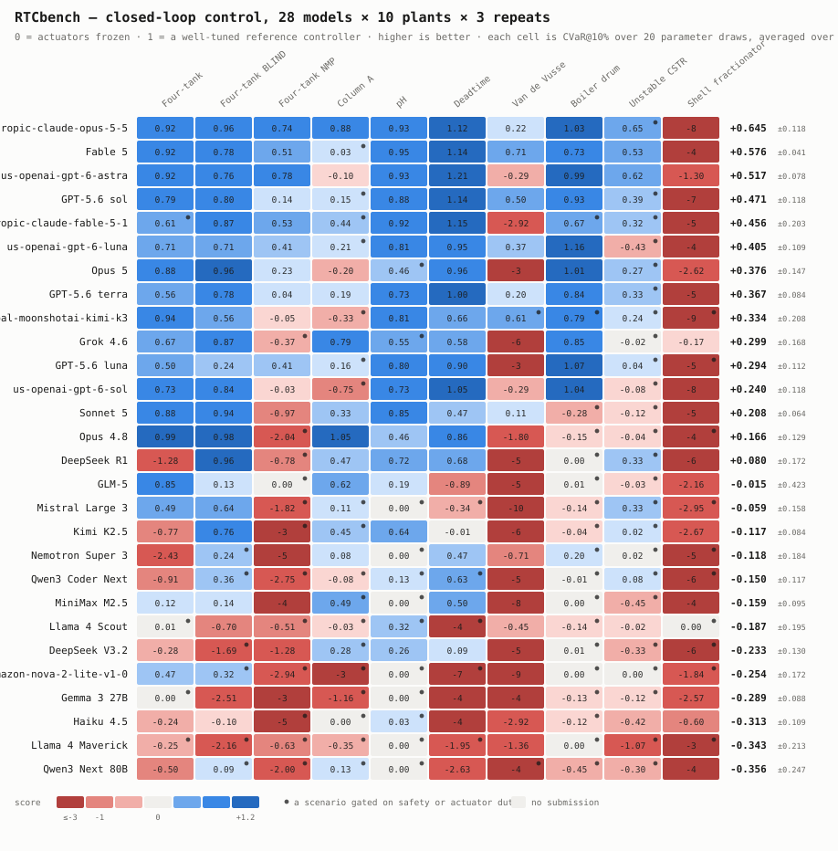

# RTCbench

**A benchmark for language models that commission real closed-loop control systems.**

Not a control-theory quiz. Nothing here is graded by reading an answer. A submission is a
*controller*; it gets wired to a dynamic process simulation it has never seen, and it is
judged on what the plant actually does.

```bash
pip install -e .
python experiments/report.py --out out/report.html      # the current results
rtcbench score --task tasks/four_tank_v1.yaml --controller examples/pi_controller.py
```

Ten plants, 190 tests, two dependencies, no GPU. A full scoring pass runs on a laptop.

---

## The current standing

Twenty-eight models, ten plants, **three independent commissioning runs each** — 840
episodes through one identical harness.

<picture>
  <source media="(prefers-color-scheme: dark)" srcset="leaderboard/matrix_2026-09-24-dark.svg">
  
</picture>

Cells are means over three runs; the suite column carries the run-to-run interval. **[Full
report](leaderboard/report.html)** · [aggregate](leaderboard/aggregate_2026-09-24.json).

| | |
|---|---|
| Leader on the mean | **claude-opus-5-5**, **+0.645 ± 0.118** — but read the next row first |
| Genuinely separated ranks | **none.** No adjacent pair's intervals fail to overlap |
| Median run-to-run spread | **0.248** — larger than the entire top-six span of **0.240** |
| Tightest | **claude-fable-5**, spread **0.082**: second on the mean, first on consistency |
| Widest | **glm-5**, ranging +0.364 to −0.482 on identical tasks |

**Read the table as a band, not an order.** At twenty models the top three were genuinely
separated; at twenty-eight, nothing adjacent is. The field got denser while the noise stayed
put, and the median run-to-run spread now *exceeds* the span of the entire top six. Even the
leader is not separated from second place: claude-opus-5-5 ranges +0.546 to +0.781,
claude-fable-5 +0.532 to +0.614.

Two models added this run make the point on their own. claude-fable-5-1 scored +0.218 on its
first run and +0.623 on its third; kimi-k3 went +0.504 then +0.087. Either single run would
have supported a confident and wrong story about a model generation.

Two findings from the repeats are worth more than the ranking:

**Variance is inherent, not a harness artefact.** Documenting the exact controller interface
halved total crashes (244 → ~127 per run) and lifted nemotron-super from last to mid-table.
It did **not** narrow the spreads — grok's actually widened, 0.265 → 0.335. If crash-driven
noise had been the cause, removing the crashes would have collapsed it. So repeats are
permanent policy here, not a one-off correction.

**Reliability and control quality are separable.** Across the field, crashes correlate with
suite score at −0.40 and safety gating at −0.82. Among controllers that run cleanly, how much
the valve actually moves correlates at +0.04 — nothing. Whether a controller survives its own
scenarios predicts its score; how well it controls barely shows up until that is settled.

## What makes a score here mean something

**Every score is anchored between two controllers you can read and re-run.** `0.0` is
freezing the actuators; `1.0` is the maintainers' well-tuned reference, gains published in
the task file. Above 1.0 beats it. Because the *unit of measurement* is a properly tuned
baseline, there is no way to look good by beating a weak one — and the reference's tuning is
itself a regression test, because the first draft of `four_tank_v1` shipped gains that the
naive example submission beat, which silently inflates every score on a task.

**Safety is a gate, not a penalty term.** Any hard-constraint violation zeroes the scenario,
as does exceeding the published actuator-duty limit. Real plants do not trade an overflow
against a bit of integral error, and a controller that holds setpoint by hammering the valve
is rejected on wear, not discounted.

**Ranked on the bad tail.** The headline is CVaR@10% — the mean of a submission's worst
scenarios — not the average. Mean-ranking rewards a controller that is excellent on most
parameter draws and unsafe on a few, which is exactly the controller nobody wants
commissioned.

**Tasks are validated before anyone is scored on them.**

```bash
rtcbench validate --task tasks/boiler_drum_v1.yaml
```

checks that doing nothing does not already violate, that the reference is safe on every
draw, and that the anchors are properly separated. A scenario no controller can pass is
noise in the ensemble. This has caught real defects in this repo's own tasks more than once.

**Every run is falsifiable.** `rtcbench replay` recomputes a record's metrics from its own
stored trace, so a published score need not be taken on faith, and any run renders as a
PV/SP/OP trend — the view where a controller that "wins" by chattering is obvious in three
seconds.

---

## The plant pack

Each plant exists to defeat a *different* naive controller. One that handles all nine is not
pattern-matching a PID recipe.

| Plant | The trap it sets |
|---|---|
| `four_tank` | Johansson's quadruple tank, minimum phase — the gentle one |
| `four_tank_nmp` | same rig, RHP transmission zero: the obvious pairing is **wrong** |
| `column_a` | Skogestad's 41-stage column — severe ill-conditioning |
| `ph_neutralization` | process gain varies by orders of magnitude across the range |
| `deadtime_process` | deadtime moves with throughput; a fixed Smith predictor degrades |
| `van_de_vusse` | steady-state gain **reverses sign** across the operating range |
| `boiler_drum` | inverse response — level falls before it rises (shrink and swell) |
| `unstable_cstr` | open-loop unstable: frozen actuators do not hold position |
| `shell_fractionator` | Prett & Morari 3×3, per-element deadtimes and constraints |

All are pure-numpy reimplementations from published equations, cited in each module. There
is no property database, no equation of state, no flash — every constant comes from its
source paper, which is why the physics stays at 4–54 lines per plant.

Several carry a deliberate extra trap: **a signal that is constrained but not instrumented.**
On the four-tank you must not overflow a tank you cannot see.

---

## Writing a submission

Expose a class named `Controller`. That is the entire interface.

```python
class Controller:
    def __init__(self, brief): ...          # tags, units, ranges, limits, T_s, safety envelope
    def reset(self): ...
    def step(self, t, y, r, quality):       # -> control vector
        ...
```

You get measurements and their quality flags. You never get the state vector — that
omission is what keeps this a benchmark about control rather than about reading a state.

**Run `rtcbench check` first.** Interface errors, not control errors, are what separate the
bottom of the leaderboard from the top: crashes correlate with suite score at −0.51, and one
model lost 40 of its 200 scenarios to `channel.min` (the field is `.lo`) and
`brief.actuator_ranges` (which does not exist). The check constructs your controller, resets
it and steps it five times, and prints the real field names when it fails.

Start from [`examples/pi_controller.py`](examples/pi_controller.py), which is deliberately
competent-but-unremarkable and says so.

```bash
rtcbench check --task tasks/column_a_v1.yaml --controller mine.py   # does it even fit the interface?
rtcbench show  --task tasks/column_a_v1.yaml          # the operating manual you'd be handed
rtcbench run   --task tasks/column_a_v1.yaml --controller mine.py --out out/
rtcbench score --task tasks/column_a_v1.yaml --controller mine.py --trends out/
```

To run a model against the suite end to end, see
[`experiments/commission.py`](experiments/commission.py).

---

## Documentation

| | |
|---|---|
| [DESIGN.md](DESIGN.md) | why the benchmark is shaped this way — read before changing architecture |
| [ROADMAP.md](ROADMAP.md) | what is next, and what is deliberately not being built |
| [CONTRIBUTING.md](CONTRIBUTING.md) | how to contribute, and what gets rejected |
| [docs/AUTHORING_PLANTS.md](docs/AUTHORING_PLANTS.md) | adding a plant — three files, plus the lessons that cost us tasks |
| [AGENTS.md](AGENTS.md) | orientation for coding agents working in this repo |

---

## Status, honestly

v0.2. The harness, scoring, records, replay, trends, nine validated tasks and a full
multi-model run all work and are tested.

What is **not** built, stated plainly because a benchmark that oversells itself is worthless:

- **The sandbox is a speed bump, not a security boundary.** `--sandbox` runs a submission
  in a separate process that cannot import the plant, cannot open a socket, and has its step
  budget enforced from outside. It stops an ordinary submission cheating by accident or by
  obvious intent — which is not hypothetical, since an agent with repository access has
  already read the reference gains out of a task file and reported them as its own tuning.
  It does not stop a determined attacker, who has `ctypes` and a hundred other doors, and it
  does not confine the filesystem. Run genuinely untrusted code in a container.
- **No independent oracle.** Plants are checked by tests written alongside them, which is
  self-consistency, not correctness. A sign error would pass.
- **No commissioning CLI.** The design calls for a metered phase where an agent bump-tests a
  training replica; today `experiments/commission.py` is the working stand-in.
- **No sealed test set and no leaderboard automation.** The salt-derived seed machinery
  exists; the governance around it does not.

---

## License and governance

**Apache-2.0** for code, **CC-BY-4.0** for tasks and results. DCO sign-off, not a CLA.

Apache rather than MIT for the patent grant: process control is a patented field, and a
corporate contributor's counsel will look for that clause and not find it in MIT. It is
otherwise equally permissive.

RTCbench originated at [Acaysia](https://github.com/AcaysiaChem) and is governed
independently. Core has **zero** Acaysia dependencies — not in `pyproject.toml`, not in CI,
not in the tests — and stays that way. Proprietary and copyleft engines (AcaysiaRT,
DWSIM/CAPE-OPEN) plug in behind the same `Plant` protocol as everything else, out of tree,
and cannot host scored tasks for the same reason in both cases: a stranger cannot reproduce
them. See [DESIGN.md](DESIGN.md) §1–2 and §7.
